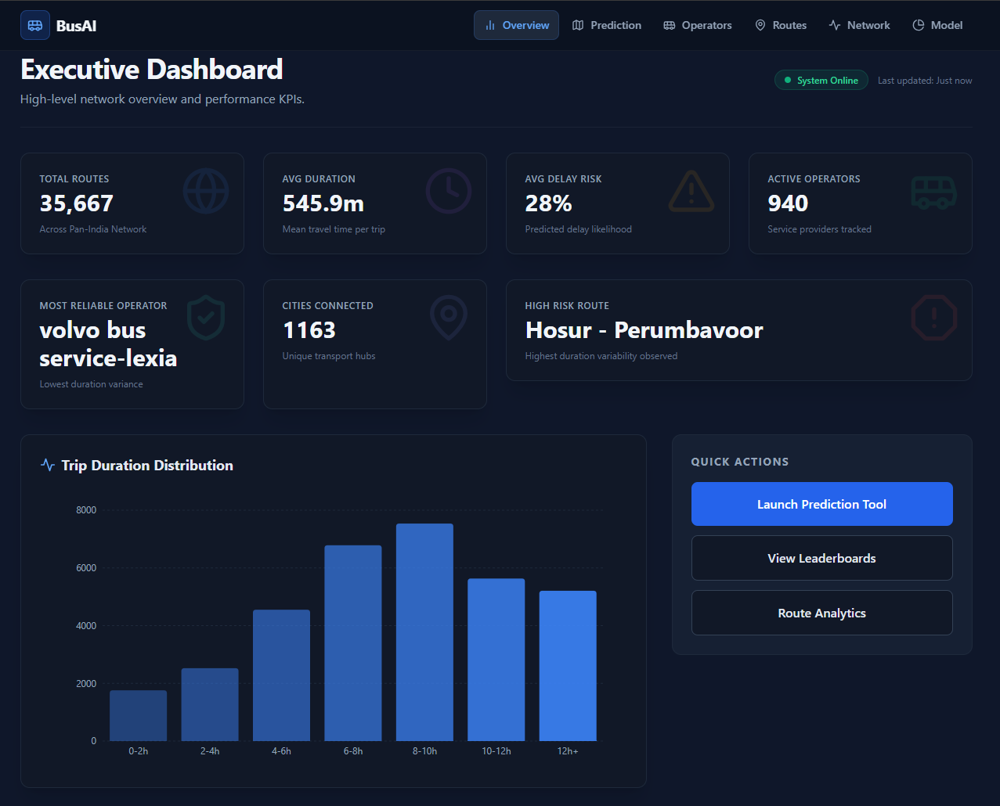
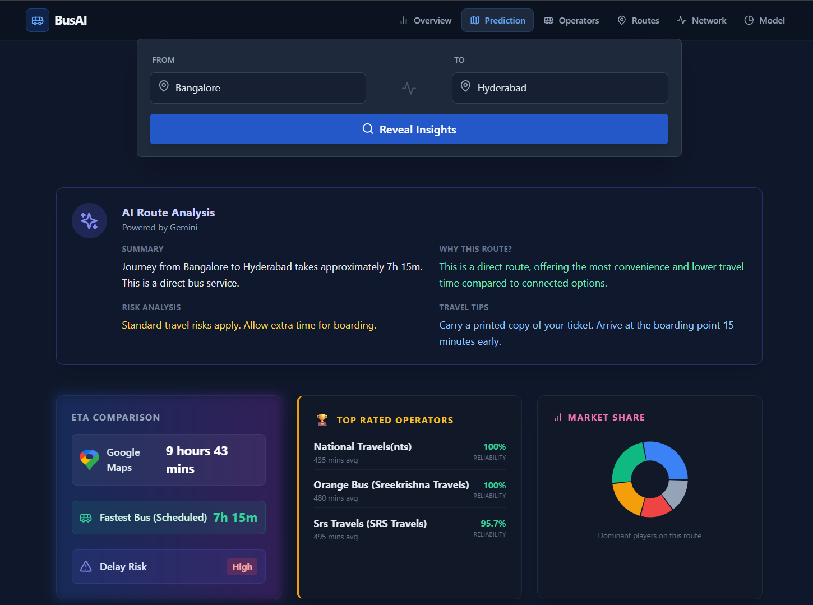
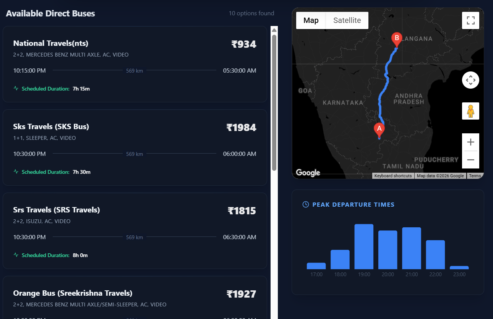
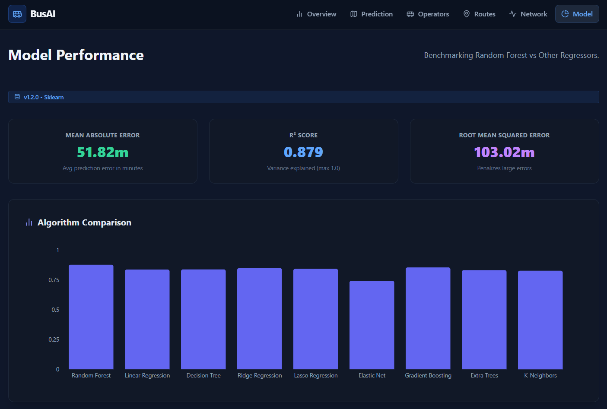

# 🌐 Web Dashboard Overview

The Transport Intelligence Platform includes a professional SaaS-style dashboard designed for analytics and decision support.

---

## 🎨 Design System

- Enterprise dark theme
- KPI cards
- Interactive charts
- Responsive layout
- Google Maps integration

---

## 🏠 Dashboard Page

Displays:

- Total Predictions
- Avg Duration
- Delay Distribution
- Operator Leaderboard

---

## ⏱ Travel Time Prediction

Users can input:

- From City
- To City
- Departure Hour
- Operator

System returns:

- Predicted Duration
- Confidence Interval
- Delay Risk
- Route Visualization
- Google ETA vs ML ETA

---

## 🏢 Operator Analytics

Shows:

- Reliability Score Ranking
- Delay Percentage
- Speed Consistency
- Market Share

---

## 🗺 Route Recommendation

If no direct route exists:

- Suggests connected routes
- Displays intermediate stops
- Shows aggregated duration
- Provides AI explanation

---

## 📊 Visualization Features

- Bar charts
- Line charts
- Pie charts
- Heatmaps
- Map-based route rendering

---

## 🚀 Deployment Ready

- Dockerized services
- API versioning
- Environment configs
- Production logging
